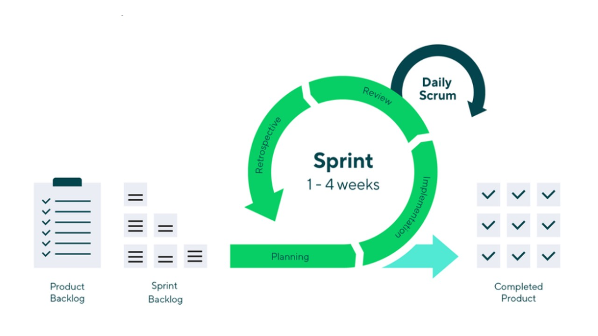
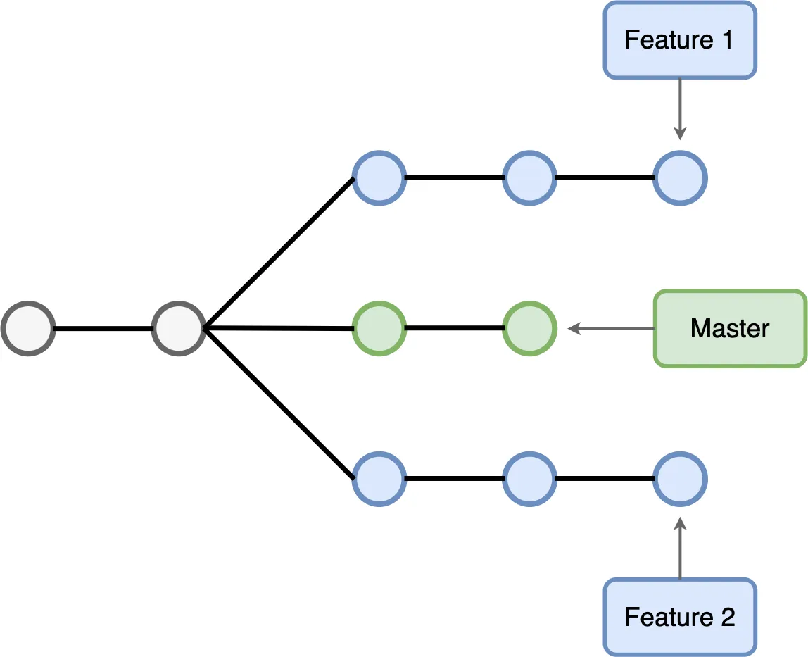
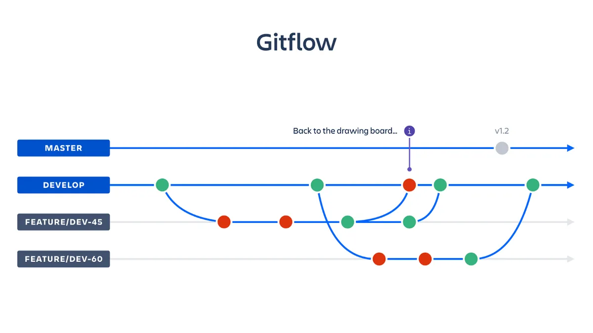
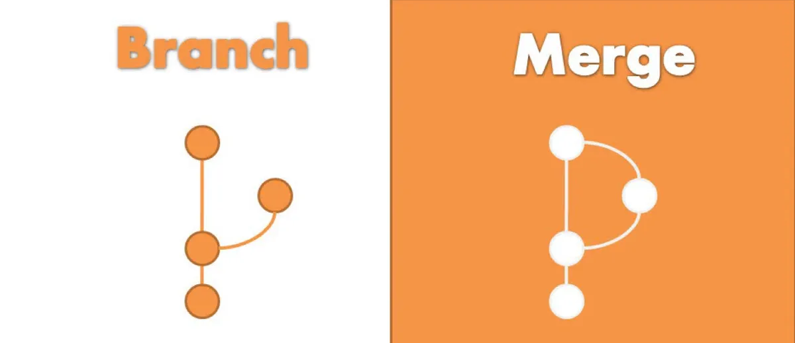
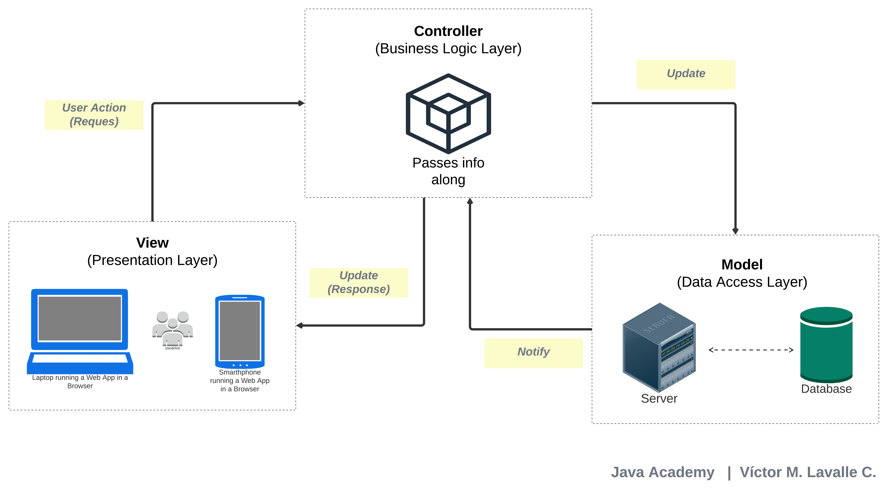
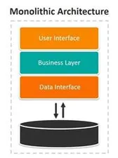
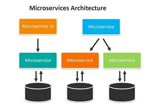
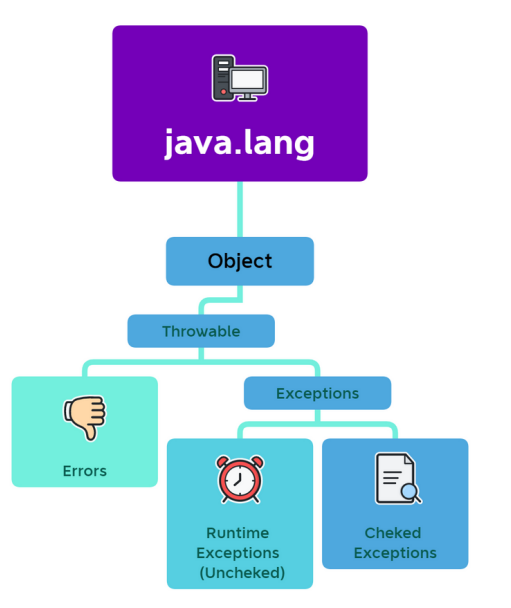
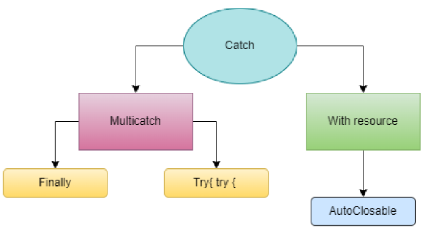
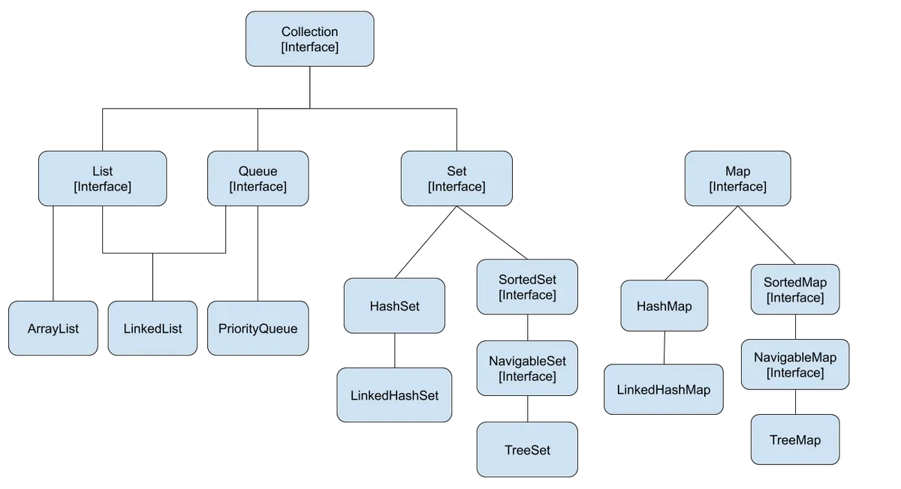

# Java Academy 2023 - Exam Week 2 

**Víctor Manuel Lavalle Cantón**


## Table of contents

[TOC]

### Question 1 - What are the steps to implement SCRUM


#### What is SCRUM?

Scrum is one of the most popular **agile frameworks**. It is an adaptive, iterative, fast, flexible and efficient framework, designed to deliver significant value quickly throughout the value quickly throughout the project. Scrum ensures **communication transparency** and creates an environment of **collective responsibility** and **continuous progress.**

The Scrum framework is structured in a way that is compatible with product and service development in all types of industries and on any type of project, regardless of its complexity. A key strength of Scrum is lies in the use of cross-functional, self-organizing and empathetic functional, self-organized and empowered teams that divide their work into short, concentrated **work cycles** called **Sprints**.

#### How to implement SCRUM?

1. **Choose a product owner:** This individual is the one who has the vision of what you are going to do, produce or achieve. This person must balance multiple attributes of the product, so he/she takes into account the *risks* and *rewards*, *what is possible*, *what can be don*e and  must have the vision for the product.

   

2. **Select a team:** *<u>Who will be the people who will actually do the work?</u>* 
   This team must have all the necessary skills to take the product managers' vision and make it a reality.
   The teams should be small, *three to nine* people as a general rule.

   

3. **Select an SCRUM Master**:  This person is a facilitator for the team. He/she will ensure that the team follows the Scrum process and helps to remove any obstacles that may impede the team's progress. The Scrum Master also acts as a coach for the team and the organization, helping to promote and implement Scrum. They also protect the team from external interference and ensure that the team is fully functional and productive.

   

4. **Create and prioritize a product backlog**: The *<u>backlog</u>* is a list that contains all the needs to achieve the product. This backlog should contain everything that the team could do with its due order of priority. The product backlog is unique and the product owner is responsible for prioritizing decisions regarding the product. In the same way, the product owner must consult with all those who are needed, such as the team, to ensure that it represents what people need and what can be done.

   

5. **Refine and estimate the product backlog**: One of the most important activities to be done is the *<u>estimation of the effort required</u>* to perform the backlog items, for this the working team must examine the element by asking questions like:

   * Is there enough information to carry out the item? 

   * Is it small enough to be estimated?

   *  Is there a definition of done? 

   * Does this create visible value?

     

6. **Sprint planning:** The <u>*sprint*</u> consists of meetings of a fixed length, preferably less than one month, which is planned by the team, Scrum Master, and product owner with the purpose of showing progress on the project, as well as any improvements or modifications that are to be made. 
   Another purpose of the sprint is to know the team's velocity (the number of points accumulated during the sprint) and it is the duty of the Scrum Master and the team to try to increase the team's velocity. During this meeting, everyone must also agree on a sprint goal that everyone must meet during this sprint.

   

7. **Make the work visible:** The Dashboard contains three columns: 

   * *Pending*
   * *In Process*
   * *Finished.* 

   This helps to represent the status of the items so that we know when they are pending, in progress, or done. Another way to make the work visible is to *<u>create a burn-down chart</u>*. On one axis is the number of points that the team entered in the sprint and on the other is the number of days. Each day, the Scrum Master adds the number of completed points and graphs them on the burn-down chart. Ideally, there will be a downward slope leading to zero points for the last day of the sprint.

   

8. **Daily SCRUM Meetings (Daily Standup): **This is the heartbeat of Scrum. E*very day, at the same time*, for *<u>no more than 15 minutes</u>*, the team and the Scrum Master meet and answer three questions:

   * *What did you do yesterday to help the team finish the sprint?*

   * *What will you do today to help the team finish the sprint?*

   * *Are there any obstacles preventing you or the team from accomplishing the sprint goal?*

     

   What this does is help the team know exactly where everything is in the course of a sprint.
   in the course of a sprint.

   

9. **Sprint review or sprint demonstration:** This is the meeting where the team shows what it did during the sprint. Everyone can attend, not just the product owner, Scrum Master, and team, but also other stakeholders, management, customers, whoever. 
   This is an open meeting in which the team demonstrates what they were able to bring to completion during the sprint. The team should only show what meets the definition of completed, fully completed, and can be delivered without additional work. This may not be a finished product, but rather a completed feature of one of them.

   

10. **Sprint retrospective: **Once the team has shown what they achieved in the latest sprint, the "finished" thing and the possibility of sending it to customers for feedback, we can think about w*<u>hat went well, what could have gone better, and what can be improved in the next sprint</u>*. 

    This leads us to ask ourselves the following question: 

    * *<u>What is the improvement in the process that the team can implement immediately?</u>*

    It is crucial that people, as a team, take responsibility for their process and their results and seek solutions as a team. At the same time, they should have the strength to address uncomfortable issues in a solution-oriented, not accusatory way. And the rest of the team must have the maturity to hear the feedback, accept it, and seek a solution, not become defensive. 

    At the end of the meeting, the team and the Scrum Master should agree on a process improvement that they will implement in the next sprint. This process improvement, also called *<u>kaizen</u>*, should be incorporated into the next sprint log, with acceptance tests. In this way, the team will be able to easily see if they actually implemented the improvement and what effect it had on the speed.

    

    11. **Immediately start the next sprint cycle**: Taking into account the team's experience with the
        experience of the team with the impediments and process improvements.


------


### Question 2 - Explain what is a branch, merge and conflicts

#### Branching

A branch in Git is a distinct line of development that enables several users to work simultaneously on the same codebase without affecting each other's contributions. A branch is a duplicate of the codebase's current state that can be produced and edited separately from the main branch. Thus, modifications can be made, tested, and then when ready, merged back into the main branch.



The basic command to create a new branch in Git is"`git branch`. The command takes the name of the new branch as an argument, like so:

```bash
git branch a-new-branch
```

This creates a new branch called "my-new-branch" that is based on the current branch you are on. To switch to the new branch and start working on it, use the command "git checkout" followed by the name of the branch:

```bash
git checkout a-new-branch
```

Once you are on the new branch, you can make changes and commit them as usual. To see a list of all the branches in the repository, use the command `git branch -a`. To switch back to the `main` branch, you can use the command "git checkout `main`"

You can also create a new branch and switch to it in a single command by using the command

```bash
git checkout -b a-new-branch
```

<u>This command creates a new branch called `a-new-branch` and switches to it all in one step.</u>


##### Gitflow

In order to manage *software development*, Git uses a particular branching model called ***Gitflow***. It is a well-liked and frequently used *branching mechanism* that aids developers in managing and organizing branches inside of a Git repository. 

The **`main`** branch and the **`develop`** branch serve as the foundation for the gitflow concept. While the develop branch is used for continuing development, the main branch represents code that is ready for production. **Feature branches** are developed from the develop branch to work on particular features or bug fixes. A feature is finished when it is ready and then merged back into the develop branch. When the develop branch is stable, it is merged with the master branch, which results in the creation of a new release.



Additional branches for managing releases and **hotfixes** are also included in Gitflow. The git-flow command-line tool, which automates many of the branching and merging processes involved in this workflow.


#### Merge

A merge in Git is the action of integrating changes from one branch with another. When work on a feature or bug repair is finished and has to be merged into the main development branch, this is normally done (often called "main" or "master").

The `git merge` command is the most popular way to carry out a merging in Git, while there are other approaches as well. This command's basic syntax is as follows: `git merge <branch>`. 

E.g.  `git merge feature_x`

Git will automatically try to merge the changes from `feature x` into `main` when you run this command. The merge will be successful if there are no conflicts between the two branches, and you can continue working on the "main" branch.

It's worth noting that git also provides a command `git merge --no-ff` that will always create a new commit instead of fast forwarding. This can be useful for keeping a record of when a feature was merged into the main branch.

Another command `git merge --squash` that will combine all the commits of the branch to be merged into one single commit. This is useful when you don't want to keep the commits history of the feature branch and also make the master branch cleaner.




#### Conflicts

Conflicts arise when Git is unable to automatically integrate changes made to the same lines of code in both branches. Git will then prompt the developer to manually resolve the dispute by determining which modifications to preserve and which to discard by marking the conflicting lines in the code. The developer can commit the modifications and continue the merge process after the conflicts have been resolved.

In short terms, conflicts occur when the same lines of code are edited in two branches at the same time and Git is unable to automatically merge the changes. 

------


### Question 3 - Design and explain the  MVC pattern design

#### What is MVC?

It stands for  - *Model View Controller* -   Is a design pattern, which has as its main objective to separate the processes of ***business logic***, ***data access*** and the ***view*** that we will present to the user. This pattern can be used for the development of web, desktop, mobile and  among others.




in the image above we can see 3 modules with specific tasks:

* **Model:** Stores and manages data. Most of the time, the models represent tables of a database.
* **View:** Is the *Graphical Use Interface (GUI)*. This contains all all functionality that directly interacts with the user - like clicking a button, or an enter event. In other words, is a visual representation of the data.
* **Controller**: is the *Master Mind* of the application. It's in charge of connect the model and view. The controller receives input from view, uses logic to translate the input to a demand for the model, the model grabs the data, the controller passes data from the model back to the view for the user to see in a nice display.


Using this design pattern allows to take advantage the modular design to the designers and developers to work together and to rapidly prototype. This separation also allows changes to be made to one part of the application without affecting the others.


An example of the real world is:

1. a **User** clicks a link that points to https://www.udemy.com, so thee browser **makes a request to the web server.**
2. The url must be checked and pass the request to the **controller**.
3. The **controller** use the **business logic** to check if the user has been login.
4. The **controller** use the **models** to access to the data of the application. 
5. Once the **controller** finish with the data, it send the data to the **view**. The **view** take this data and get them ready to show them to the user. 
6. Once the object in charge of process all the needed data to build a complete view, it is given back to the user.


This is a visual representation of what is going on in the example above.

------


### Question 4 - What is the difference between monolithic and micro-services? - Design and explain them.


#### Monolithic Architecture

Is a software development approach where all the components of a software application are bundled together in a single unit or codebase.  is known to be the conventional method usedto build apps. This is basically a consolidated model, where all the software elements are interconnected.

In other words, this indicates that the application's various functionalities are all tightly connected and integrated into a single codebase, making it challenging to change or update one aspect of the application without also affecting the others.




#### Microservices

Microservices architecture is a software development approach in which a software application is divided into small, independent services. Each microservice is in charge of a specific function and can be developed, tested, and deployed independently of the others. This provides greater flexibility and scalability because changes or updates to individual services do not affect the entire application.




#### Which one is better?

In terms of design, monolithic applications typically have a single, large codebase that tightly integrates all of the application's components, whereas microservices applications have multiple small codebases, each responsible for a specific functionality. 

The codebase is usually shared between different components or functionalities in monolithic architecture, which means that any changes made to one component can potentially affect other components, making it more difficult to understand and maintain. Microservices architecture, on the other hand, allows for a clear separation of concerns, making it much easier to understand and maintain the various components of the application.

As the application grows, monolithic architecture can become a *<u>bottleneck</u>* in terms of scaling. When a single component becomes a bottleneck, the entire application suffers. Individual services in a microservices architecture can be scaled independently, reducing the risk of bottlenecks and increasing the overall scalability of the application.

**Go with the monolithic architecture if:**

- Working on a startup and only a small team will be building the application.

- Don’t have the time or money to spend on building an app using a complex architecture.

- Your team have the experience using this architecture and know that there wouldn’t be any performance bottlenecks.

  

**Go with the monolithic architecture if:**

- You have diverse teams with people with knowledge and experience in different languages.
- You don’t have to meet a strict deadline, because this architecture requires proper research and planning in order to be successful.
- If scalability is one of your big concerns.

To summarize, monolithic architecture is a traditional approach in which all of an application's components are tightly integrated into a single codebase, whereas microservices architecture is a more modern approach in which an application is broken down into a collection of small, independent services that can be developed, tested, and deployed independently.


------


### Question 5 - Explain what are the exceptions

An exception is an ***occurrence during program execution*** that disrupts the normal flow of instructions. Errors, such as a missing file, a failed network connection, or an invalid input, are commonly the cause of exceptions. When an exception occurs, the Java runtime system creates an object representing the exception and sends it to the nearest exception handler.



#### Types of Exceptions

* **Throwable:** It is a class that represents everything that can be "**thrown**" in Java. It contains a snapshot of the state of the memory stack at the moment the object was created, which is also called ***stack trace*** or ***call chain.*** Below, some methods of the Throwable class will be shown along with a description.

  * **getMessage():**  Used to get an error message associated with an exception.

  * **printStackTrace():** Used to print the record of the stack where the exception has been initiated

  * **toString():** It is used to display the name of an exception along with the message returned by getMessage().

  * **void printStrackTrace:**  Displays an object and the stack trace of the call stack trace.

    

* **Error:** "t indicates a serious problem, as this problem cannot be solved in any way, so a program normally stops. Some examples of error can be: if you want to access the hard drive, but it is damaged, having no internet connection, a failure in electricity, not having permission to modify a file, among others. We can conclude that these errors are external to the program.

  * **AnnotationFormatError**: Generated when the annotation parser attempts to read an annotation from a class file and determines that the annotation is malformed.
  * **AssertionError**: Thrown to indicate that an assertion has failed.
  * **CoderMalfunctionError**: An error is generated when the decodeLoop method of a CharsetDecoder, or the encodeLoop method of a CharsetEncoder, throws an unexpected exception.
  * **FactoryConfigurationError:** Thrown when there is a configuration problem with Parser Factories. This error will usually be generated when the class of a parser factory specified in the system properties cannot be found or instantiated


* **Runtime Exception (Unchecked):** In this type of exceptions, the compiler does not require the use of try-catch clauses. Therefore, the only thing we can do is that our program fails and shows the error message to the user, in this way after knowing the error we can implement a try-catch so that the compiler allows us to run the program.

  * **ArithmeticException:** Thrown when an exceptional arithmetic condition has occurred. For example, an integer "divide by zero" returns an instance of this class.

  * **IllegalArgumentException:** Thrown to indicate that an illegal or inappropriate argument has been passed to a method.

  *  **ArrayStoreException:** Thrown to indicate that an attempt was made to store the wrong object type in an object array.

  * **IndexOutOfBoundsException:** Thrown to indicate that an index of some type (such as an array, string, or vector) is out of range.

    

* **Checked Exception:** 

  In this type of exceptions, the compiler requires the use of try-catch clauses or requires throwing the exceptions. Therefore, it is less likely that this type of exceptions occur since the compiler indicates when we have an error of this type.

  * **PrintException:**The PrintException class encapsulates a printing-related error condition that occurred while using an instance of the print service.

  * **PrinterException:** The PrinterException class and its subclasses are used to indicate that an exceptional condition has occurred in the printing system.

  *  **IOException:**Indicates that an I/O exception of some kind has occurred. This class is the general class of exceptions thrown by interrupted or failed I/O operations.

    

------


### Question 6 -  Explain what is Multicatch and try -with-resource



#### Mulicatch

Multicatch is a Java feature that allows a single catch block to handle multiple exception types. This results in more efficient and concise code by removing the need for multiple catch blocks when dealing with similar types of exceptions.

For example, let's say you have a method that reads a file and performs some operation on it. If the file cannot be found or if the file format is incorrect, you should catch both the `FileNotFoundException` and the `IOException`. You'd have to use two separate catch blocks like this without multicatch:

```java
try {
    // read file and perform operation
} catch (FileNotFoundException e) {
    // handle exception
} catch (IOException e) {
    // handle exception
}
```

With multicatch, you can handle both exceptions in the same catch block like this:

```java
try {
    // read file and perform operation
} catch (FileNotFoundException | IOException e) {
    // handle exception
}
```


#### Try-With-Resources

 is also a Java feature that allows to **close resources** that are used within a try block automatically. <u>It is no longer necessary to use explicit finally blocks to close the resources.</u> This feature is especially useful when working with **AutoCloseable**-enabled resources such as files, sockets, and database connections.


A good example is the following:

We want to read the contents of a file and print it in the console. The typical way, would be:

```java
FileReader fileReader = null;
try {
    fileReader = new FileReader("file.txt");
    // read and print file contents
} catch (FileNotFoundException e) {
    // handle exception
} catch (IOException e) {
    // handle exception
} finally {
    if (fileReader != null) {
        try {
            fileReader.close();
        } catch (IOException e) {
            // handle exception
        }
    }
}
```


With try-with-resources, we can automatically close the file by declaring it in the try statement (it's not need to explicitly close the resource after using it):

```java
try (FileReader fileReader = new FileReader("file.txt")) {
    // read and print file contents
} catch (FileNotFoundException e) {
    // handle exception
} catch (IOException e) {
    // handle exception
}
```


------


### Question 7 - Explain and mention the types of Collections

**Java Collections** is a framework for storing and manipulating collections of objects. It includes a number of classes and interfaces, such as **List**, **Set**, **Queue**, and **Map**, that can be used to store and manipulate data in various ways. These classes and interfaces allow you to work with a group of objects as a single unit rather than each object individually. They are included in the **java.util package** and can be found in any Java application.




* **List interface**: is used to store a set of elements in a particular order. It supports duplicate elements and offers methods for adding, removing, and accessing elements by index. The List interface is commonly implemented by the `ArrayList` and `LinkedList` classes.

  

* **Set interface:** is used to store a set of distinct elements. It does not permit duplicate elements and provides methods for adding and removing elements, as well as determining whether an element is present in the set. The Set interface is commonly implemented by the `HashSet` and `TreeSet` classes.

  

* **Queue interface**: like a list, is used to store a collection of elements in a specific order, but it also provides methods for adding and removing elements in a specific order. The `PriorityQueue` class is a common Queue interface implementation.

  

* **Map interface:** is used to store a collection of key-value pairs, each of which is unique and corresponds to a specific value. This one doesn't come from **Collections**, but anyway it includes methods for *adding*, *removing*, and *retrieving* elements based on their ***key***, making feel similar when working with relational databases  . The Map interface is commonly implemented by the `HashMap` and `TreeMap` classes.

