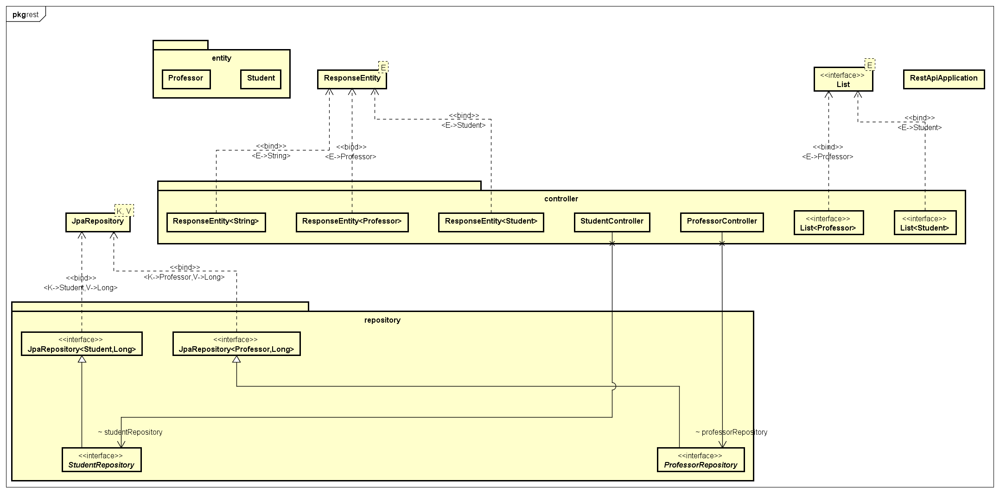
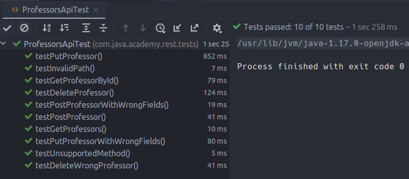
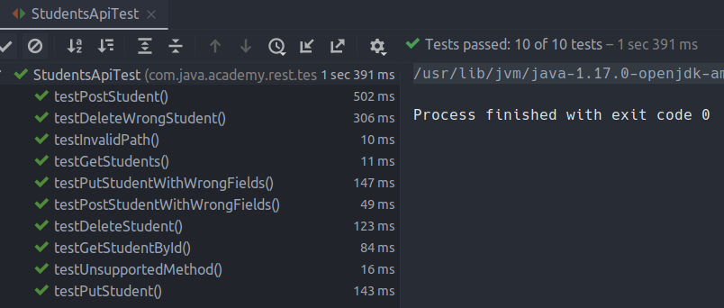
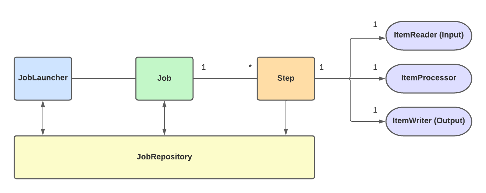

# Java Academy 2023 - Exam Week 3 

**Víctor Manuel Lavalle Cantón**


## Table of contents

[TOC]

### Question 1 - Git Advance  commands (Pull Requet, Fork, Rebase, Stach, Clean, Cherry-pick, etc)

- **Pull Request:** A pull request is a feature in Git that allows users to request changes to a project by proposing changes to a code repository. It enables collaboration and code review within a team, as well as the integration of contributions from external contributors. 

  

  Steps of how to make a Pull Request:

  1. **Clone the repository:** First, it is necessary to "clone" the repository to your local computer, so you can start making changes to the code.

  2. **Make changes:** Now that you have the code on your local computer, you can start making changes. You can add, modify or delete files, or even create new branches if you want to experiment with different ideas.

  3. **Commit changes:** When you're done making changes, you need to "commit" those changes to your local repository. A commit is a snapshot of the code at a particular point in time.

  4. **Push changes:** Finally, you need to "push" your changes back to your forked repository on GitHub. This will upload all the commits you made to the online repository.

  5. **Create a Pull Request:** Once you've pushed your changes to your forked repository, you can create a Pull Request. A Pull Request is a request to the original repository to merge your changes into their code.

  6. **Review and discussion:** The repository owner and other collaborators can now review your changes, ask questions, and provide feedback. They can also "approve" the Pull Request, indicating that they think your changes should be merged into the main code.

  7. **Merge:** If the Pull Request is approved, the repository owner can "merge" your changes into the main code. At this point, your changes become part of the official codebase.

     

  Pull Requests, in summary, allow developers to propose changes to a project's code, solicit feedback, and collaborate on codebase improvements before those changes are merged into the main code.

  

- **Fork:** In Git, a fork is a copy of a repository in your own GitHub account. When you fork a repository, you create a new, independent repository that is completely independent of the original. You can modify your fork without affecting the original repository, and you can also propose changes to the original repository by submitting a Pull Request.

  Steps of how to make a fork in Git:

  1. Go to the repository you want to fork: Navigate to the repository you want to fork on GitHub and click on the "Fork" button in the upper right-hand corner.
  2. Select your account: If you have multiple GitHub accounts, select the account where you want to create the fork.
  3. Wait for the fork to complete: GitHub will now create a copy of the repository and store it in your account. This may take a few minutes, depending on the size of the repository.
  4. Clone the fork: Once the fork is complete, you need to clone the repository to your local computer. To do this, click on the "Clone or download" button, copy the repository URL, and then use Git to clone the repository to your local machine.
  5. Make changes: Now that you have the code on your local computer, you can start making changes. You can add, modify, or delete files, or even create new branches if you want to experiment with different ideas.
  6. Commit changes: When you're done making changes, you need to "commit" those changes to your local repository. A commit is a snapshot of the code at a particular point in time.
  7. Push changes: Finally, you need to "push" your changes back to your fork on GitHub. This will upload all the commits you made to the online repository.

  

  

- **Rebase:** Rebase is a Git command that merges fresh modifications from another branch into the current branch. It entails rewriting the branch's history so that it appears to be produced from the most recent modifications in the target branch. It's critical to recognize that rebasing can cause problems with collaboration since it affects the history of a branch, and it can lead to disagreements when different individuals work on the same branch. As a result, it is generally recommended to use rebasing only on personal branches and not on shared branches.

  Example of how is usually implemented this process:

  1. Suppose you have two branches: "`main`" and "`feature`".

  2. "`feature`" branch was created from "`main`" and you have made several commits on "`feature`".

  3. Meanwhile, "`main`" branch has received new commits.

  4. To integrate the latest changes from "`main`" into "`feature`", you can use the rebase command: `git rebase main`

  5. Git will reapply each commit from "`feature`" on top of the latest "`main`" branch, creating a new linear history.

  6. If there are any conflicts between the changes in "`feature`" and "`master`", Git will stop the rebase process and ask you to resolve the conflicts before continuing.

  7. After resolving the conflicts, you can use `git rebase --continue` to continue the rebase process.

  8. When the rebase is complete, "`feature`" will have a linear history that includes the changes from "`main`".

     

  *Extra*: The `git pull` command can be modified to use rebasing instead of merging by adding the `--rebase` option. For example: `git pull --rebase origin master`.

  When you run `git pull --rebase`, Git will first fetch the latest changes from the remote branch. Then, instead of merging the changes, Git will reapply the local branch's changes on top of the updated remote branch using rebasing. This will create a linear history without merge commits.


- **Stash:** The stash command is used to temporarily store changes in a Git repository. This is useful when a user needs to switch branches or perform other actions that would otherwise discard unsaved changes. Stashes are stored in a stack, which means that you can have multiple stashes and apply them in a specific order.

  A useful way of when to use a this command;

  1. Suppose you have made some changes in your current branch, but you are not ready to commit them yet.
  2. To stash the changes, run the following command: `git stash`.
  3. Git will save the changes to a temporary area and revert your working directory to the latest commit.
  4. You can now switch to another branch or perform any other Git operations without having your changes interfere.
  5. When you are ready to return to your stashed changes, use the command `git stash apply`.
  6. Git will reapply the stashed changes to your working directory.
  7. If there are any conflicts between the changes you stashed and the changes in the branch you switched to, Git will ask you to resolve the conflicts before continuing.

  

  Useful commands:

  `git stash list` Shows the list of stashes.

  `git stash show` Shows details of a specific stash entry

  `git stash apply` Applies the changes in a stash entry to the current working branch.

  `git stash pop` Applies the changes in a stash entry and removes it from the stash list.

  `git stash apply stash@{index} ` Applies a specific stash

  `git stash drop stash@{<index>}`to  discard a stash 

  `git stash clear` Removes all stash entries.

  

  

  

- **Clean:** The clean command removes untracked files and directories from a Git repository. It's used to keep the repository clean and free of files that are not under version control. It is important to keep in minad that  `git clean` command is a powerful tool, and it can be dangerous if used improperly. We must be careful when using the `-f` option, as it will permanently delete the untracked files and they cannot be recovered. If we want to be extra cautious, you can use the `-d` option to only remove untracked directories, or you can use the `-i` option to interactively select which files to remove.

  

- **Cherry-pick:** The cherry-pick command allows users to apply specific commits from one branch to another. This is useful when a user wants to bring over specific changes from one branch to another, without merging the entire branch. Also, it is required for bug fixes because bugs are committed to the development branch. 

  Is usual to use  `git cherry-pick` instead of alternative options that apply changes in the specified commits, such as `git diff`, to avoid wasteful disputes. If a full branch combine is impossible due to incompatible versions of the multiple Git branches, this utility comes in handy.

  In the other hand, *Cherry-picking* is usually discouraged in the developer community. The primary reason is that it creates duplicate commits, but you also lose the ability to track your commit history.


------


### Question 2: Develop a program using unit tests

I build a REST API developed using **Spring Boot** (With *maven*, *lombok*, and *JPA*) to manage and consult information about **Students** and **Professors** can provide a secure and convenient platform for retrieving and manipulating data. It can enable users to perform various operations such as reading, updating, and deleting student and professor records using HTTP methods such as **GET**, **POST**, **PUT**, and **DELETE**. Additionally, the API was designed with appropriate validation and error handling to ensure the data entered is accurate and secure.

#### What is unit testing?

Unit testing is a testing technique in which individual modules or components of a software application are tested to see if there is a problem with the development. The goal is to validate the components of the application's code unit based on its performance. The goal of unit testing is to ensure the correctness of isolated code.

#### **Project Structure:**




##### Entities:

```java
package com.java.academy.rest.entity;

import jakarta.persistence.*;
import lombok.*;

import javax.validation.constraints.NotEmpty;
import javax.validation.constraints.NotNull;
import javax.validation.constraints.PositiveOrZero;

@Getter
@Setter
@ToString
@NoArgsConstructor
@AllArgsConstructor
@Entity
@Table(name = "professor")
public class Professor {

    private static final long serialVersionUID = 1L;

    @Id
    @GeneratedValue(strategy = GenerationType.IDENTITY)
    @Column(name = "id_professor")
    private Long id;

    @NotNull(message = "Field must not be empty")
    @PositiveOrZero(message = "employeeNumber cannot be negative")
    private int employeeNumber;

    @NotEmpty(message = "Field must not be empty")
    private String name;

    @NotEmpty(message = "Field must not be empty")
    private String lastName;

    @NotNull (message = "Field must not be empty")
    @PositiveOrZero (message = "Class hours cannot be negative")
    private int classHours;

}
```


```java
package com.java.academy.rest.entity;

import jakarta.persistence.*;
import lombok.*;
import javax.validation.constraints.NotEmpty;
import javax.validation.constraints.NotNull;
import javax.validation.constraints.PositiveOrZero;

@Getter
@Setter
@ToString
@NoArgsConstructor
@AllArgsConstructor
@Entity
@Table(name = "student")
public class Student {

    private static final long serialVersionUID = 1L;
    @Id
    @GeneratedValue(strategy = GenerationType.IDENTITY)
    @Column(name = "id_student")
    private long id;

    @NotEmpty(message = "Field must not be empty")
    private String studentNumber;

    @NotEmpty(message = "Field must not be empty")
    private String name;

    @NotEmpty(message = "Field must not be empty")
    private String lastName;

    @NotNull (message = "Field must not be empty")
    @PositiveOrZero (message = "Average cannot be negative")
    private double average;

}
```

##### Repositories:

```java
package com.java.academy.rest.repository;

import com.java.academy.rest.entity.Professor;
import org.springframework.data.jpa.repository.JpaRepository;

public interface ProfessorRepository extends JpaRepository<Professor, Long> {
}

```

```java
package com.java.academy.rest.repository;

import com.java.academy.rest.entity.Student;
import org.springframework.data.jpa.repository.JpaRepository;

public interface StudentRepository extends JpaRepository<Student, Long> {
}

```

##### Controllers:

```java
package com.java.academy.rest.controller;

import com.java.academy.rest.entity.Professor;
import com.java.academy.rest.repository.ProfessorRepository;
import org.springframework.beans.factory.annotation.Autowired;
import org.springframework.http.HttpStatus;
import org.springframework.http.MediaType;
import org.springframework.http.ResponseEntity;
import org.springframework.web.bind.annotation.*;

import javax.validation.Valid;
import java.util.List;
import java.util.Optional;


@RestController
@RequestMapping(value = "/", produces = "application/json")
public class ProfessorController {

    @Autowired
    ProfessorRepository professorRepository;

    /**
     * Get all the  'Professor' objects
     *
     * @return the JSON of 'professor' objects
     */
    @GetMapping(path = "/professors")
    public List<Professor> getAll() {
        return professorRepository.findAll();
    }

    /**
     * Get professors from its repository
     *
     * @param id
     * @return the professor's id and the http status of the request
     */
    @GetMapping(path = "/professors/{id}")
    public ResponseEntity<Professor> getTeacher(@PathVariable long id) {
        Optional<Professor> professorOptional = professorRepository.findById(id);
        return professorOptional.map(professor -> new ResponseEntity<>(professor, HttpStatus.OK)).orElseGet(() -> new ResponseEntity<>(HttpStatus.NOT_FOUND));
    }


    /**
     * Add Professor into the arraylist
     *
     * @param professor
     * @return http status of the post request
     */
    @PostMapping(path = "/professors", produces = MediaType.APPLICATION_JSON_VALUE)
    public ResponseEntity<String> addProfessor(@RequestBody @Valid Professor professor) {
        professorRepository.saveAndFlush(professor);
        System.out.println("****************"+professor.getId());
        return new ResponseEntity<>("{\"id\":" + professor.getId() + '}', HttpStatus.CREATED);
    }


    /**
     * update Professor
     *
     * @param professor
     * @return http status of the post request from the update
     */
    @PutMapping(path = "/professors/{id}", produces = MediaType.APPLICATION_JSON_VALUE)
    public ResponseEntity<String> updateProfessor(@PathVariable Long id, @RequestBody @Valid Professor professor) {
        if (professorRepository.findById(id).isEmpty()) {
            return new ResponseEntity<>(HttpStatus.NOT_FOUND);
        }
        professor.setId(id);
        professorRepository.save(professor);
        return new ResponseEntity<>("Professor updated", HttpStatus.OK);
    }

    /**
     * delete Professor
     *
     * @param id
     * @return http status of the post request from the delete
     */
    @DeleteMapping(path = "/professors/{id}")
    public ResponseEntity<String> deleteTeacher(@PathVariable long id) {
        Optional<Professor> professorOptional = professorRepository.findById(id);
        if (professorOptional.isEmpty()) {
            return new ResponseEntity<>("Professor: ", HttpStatus.NOT_FOUND);
        }
        professorRepository.delete(professorOptional.get());
        return new ResponseEntity<>("Professor updated", HttpStatus.OK);
    }

}
```

```java
package com.java.academy.rest.controller;

import com.java.academy.rest.entity.Student;
import com.java.academy.rest.repository.StudentRepository;
import org.springframework.beans.factory.annotation.Autowired;
import org.springframework.http.HttpStatus;
import org.springframework.http.MediaType;
import org.springframework.http.ResponseEntity;
import org.springframework.web.bind.annotation.*;
import org.springframework.web.multipart.MultipartFile;

import javax.validation.Valid;
import java.util.HashMap;
import java.util.List;
import java.util.Optional;

@RestController
@RequestMapping(value = "/", produces = "application/json")
public class StudentController {

    @Autowired
    StudentRepository studentRepository;


    /**
     * Get all the  'Students' objects
     *
     * @return the JSON of 'professor' objects
     */
    @GetMapping(path = "/students")
    public List<Student> getAll() {
        return studentRepository.findAll();
    }

    
    
    /**
     * Get Student from its repository
     *
     * @param id
     * @return the student's id and the http status of the request
     */
    @GetMapping(path = "/students/{id}")
    public ResponseEntity<Student> getStudent(@PathVariable long id) {
        Optional<Student> studentOptional = studentRepository.findById(id);
        return studentOptional.map(student -> new ResponseEntity<>(student, HttpStatus.OK)).orElseGet(() -> new ResponseEntity<>(HttpStatus.NOT_FOUND));
    }


    /**
     * Add Student into the arraylist
     *
     * @param student
     * @return http status of the post request
     */
    @PostMapping(path = "/students", produces = MediaType.APPLICATION_JSON_VALUE)
    public ResponseEntity<String> addStudent(@RequestBody @Valid Student student) {
        studentRepository.saveAndFlush(student);
        return new ResponseEntity<>("{\"id\":" + student.getId() + '}', HttpStatus.CREATED);
    }


    /**
     * update Student
     *
     * @param student
     * @return http status of the post request from the update
     */
    @PutMapping(path = "/students/{id}", produces = MediaType.APPLICATION_JSON_VALUE)
    public ResponseEntity<String> updateStudent(@PathVariable Long id, @Valid @RequestBody Student student) {
        if (studentRepository.findById(id).isEmpty()) {
            return new ResponseEntity<>(HttpStatus.NOT_FOUND);
        }
        student.setId(id);
        studentRepository.save(student);
        return new ResponseEntity<>("Student updated", HttpStatus.OK);
    }


    /**
     * delete Student
     *
     * @param id
     * @return http status of the post request from the delete
     */
    @DeleteMapping(path = "/students/{id}")
    public ResponseEntity<String> deleteStudent(@PathVariable long id) {
        Optional<Student> studentOptional = studentRepository.findById(id);
        if (studentOptional.isEmpty()) {
            return new ResponseEntity<>(HttpStatus.NOT_FOUND);
        }
        studentRepository.delete(studentOptional.get());
        return new ResponseEntity<>("Professor updated", HttpStatus.OK);
    }

}
```

##### Application Properties

```yaml
#Server ip
server.address=localhost
server.port=8080

# DB configs
spring.datasource.url=jdbc:mysql://localhost:3306/springboot_rest_unit_test?useSSL=false
spring.datasource.username=vic
spring.datasource.password=password
spring.jpa.database-platform=org.hibernate.dialect.MySQL5Dialect

# Unncomment this if you want to use the existing tables in the database
#spring.jpa.hibernate.ddl-auto=none

#This is for creating the tables in the database and drop them after the application is closed
spring.jpa.hibernate.ddl-auto=create-drop

spring.jpa.show-sql=true
spring.jpa.properties.hibernate.format_sql=true
```


##### Program running: 


##### Testing

```java
package com.java.academy.rest;

import java.util.Random;

public class Constants {

    public static String URL = "http://localhost:8080";
    public static Random random;

    static {
        random = new Random();
    }

    public static int getRandomId() {
        return random.nextInt(1000000);
    }

    public static int getRandomHours() {
        return random.nextInt(50);
    }

    public static double getAverage() {
        return Math.round(random.nextDouble() * 100d) / 10d;
    }
}
```


```java
package com.java.academy.rest.tests;

import com.java.academy.rest.Constants;
import io.restassured.builder.RequestSpecBuilder;
import io.restassured.http.ContentType;
import io.restassured.specification.RequestSpecification;
import org.junit.jupiter.api.BeforeAll;
import org.junit.jupiter.api.Test;

import java.util.HashMap;
import java.util.Map;

import static io.restassured.RestAssured.given;
import static org.hamcrest.core.IsEqual.equalTo;

// This is the main class for Professors API tests
public class ProfessorsApiTest {

    // URL is a static variable that holds the base URL for API requests
    private static String URL;
    // SPEC is a static variable that holds the RequestSpecification object, used in API requests
    private static RequestSpecification SPEC;

    // This method is annotated with @BeforeAll, which means it will run once before all test methods
    // In this method, the URL and SPEC variables are initialized
    @BeforeAll
    public static void setUrl() {
        URL = Constants.URL; // Constants.URL holds the base URL for API requests
        SPEC = new RequestSpecBuilder().setBaseUri(URL).build(); // SPEC is created using the RequestSpecBuilder
    }

    // This test method tests an invalid path for the API
    // It sends a GET request to "/professorsinvaidpath" and checks if the returned status code is 404
    @Test
    public void testInvalidPath() {
        given().spec(SPEC)
                .get("/professorsinvaidpath")
                .then()
                .statusCode(404);
    }

    // This test method tests an unsupported method for the API
    // It sends a DELETE request to "/professors" and checks if the returned status code is 405
    @Test
    public void testUnsupportedMethod() {
        given().spec(SPEC)
                .delete("/professors")
                .then()
                .statusCode(405);
    }

    // This test method tests the ability to get all professors from the API
    // It sends a GET request to "/professors" and checks if the returned status code is 200 and content type is JSON
    @Test
    public void testGetProfessors() {
        given().spec(SPEC)
                .get("/professors")
                .then()
                .statusCode(200).contentType(ContentType.JSON);
    }

    // This test method tests the ability to post a new professor to the API
    // It sends a POST request to "/professors" with a professor JSON object in the body and
    // checks if the returned status code is 201 and content type is JSON
    @Test
    public void testPostProfessor() {

        Map<String, Object> professor = getProfessor(); // gets a professor JSON object

        given().spec(SPEC)
                .contentType(ContentType.JSON)
                .body(professor)
                .post("/professors")
                .then()
                .statusCode(201).contentType(ContentType.JSON);
    }

    // This test method tests the ability to get a professor by id from the API
    // It first creates a professor and gets its id, then sends a GET request to "/professors/{id}"
    // and checks if the returned status code is 200 and content type is JSON, and if the returned
    // professor name and classHours match the professor object that was created
    @Test
    public void testGetProfessorById() {

        Map<String, Object> professor = getProfessor();

        int professorId = createProfessor(professor);

        given().spec(SPEC)
                .contentType(ContentType.JSON)
                .body(professor)
                .get("/professors/" + professorId)
                .then()
                .statusCode(200).contentType(ContentType.JSON)
                .body("name", equalTo(professor.get("name")))
                .body("classHours", equalTo(professor.get("classHours")));
    }


    @Test
    public void testPutProfessor() {

        Map<String, Object> professor = getProfessor();

        int professorId = createProfessor(professor);

        given().spec(SPEC)
                .contentType(ContentType.JSON)
                .body(professor)
                .get("/professors/" + professorId)
                .then()
                .statusCode(200).contentType(ContentType.JSON)
                .body("name", equalTo(professor.get("name")))
                .body("classHours", equalTo(professor.get("classHours")));

        professor.put("name", "New Professor");
        professor.put("classHours", Constants.getRandomHours());

        given().spec(SPEC)
                .contentType(ContentType.JSON)
                .body(professor)
                .put("/professors/" + professorId)
                .then()
                .statusCode(200).contentType(ContentType.JSON);

        given().spec(SPEC)
                .contentType(ContentType.JSON)
                .body(professor)
                .get("/professors/" + professorId)
                .then()
                .statusCode(200).contentType(ContentType.JSON)
                .body("name", equalTo(professor.get("name")))
                .body("classHours", equalTo(professor.get("classHours")));

    }

    @Test
    public void testPutProfessorWithWrongFields() {

        Map<String, Object> professor = getProfessor();

        int professorId = createProfessor(professor);

        given().spec(SPEC)
                .contentType(ContentType.JSON)
                .body(professor)
                .get("/professors/" + professorId)
                .then()
                .statusCode(200).contentType(ContentType.JSON)
                .body("name", equalTo(professor.get("name")))
                .body("classHours", equalTo(professor.get("classHours")));

        professor.put("name", null);
        professor.put("classHours", -1.26d);

        given().spec(SPEC)
                .contentType(ContentType.JSON)
                .body(professor)
                .put("/professors/" + professorId)
                .then()
                .statusCode(400).contentType(ContentType.JSON);

    }

    @Test
    public void testPostProfessorWithWrongFields() {

        Map<String, Object> professor = new HashMap<>();
        professor.put("id", 0);
        professor.put("name", "");
        professor.put("lastName", null);
        professor.put("employeeNumber", -3688);
        professor.put("classHours", -1.26d);

        given().spec(SPEC)
                .contentType(ContentType.JSON)
                .body(professor)
                .post("/professors")
                .then()
                .statusCode(400).contentType(ContentType.JSON);
    }

    @Test
    public void testDeleteProfessor() {

        Map<String, Object> professor = getProfessor();

        int professorId = createProfessor(professor);

        given().spec(SPEC)
                .contentType(ContentType.JSON)
                .body(professor)
                .get("/professors/" + professorId)
                .then()
                .statusCode(200).contentType(ContentType.JSON);

        given().spec(SPEC)
                .delete("/professors/" + professorId)
                .then()
                .statusCode(200);

        given().spec(SPEC)
                .get("/professors/" + professorId)
                .then()
                .statusCode(404);

    }

    @Test
    public void testDeleteWrongProfessor() {

        Map<String, Object> professor = getProfessor();

        given().spec(SPEC)
                .contentType(ContentType.JSON)
                .body(professor)
                .post("/professors")
                .then()
                .statusCode(201).contentType(ContentType.JSON);

        given().spec(SPEC)
                .delete("/professors/" + Constants.getRandomId())
                .then()
                .statusCode(404);
    }

    // createProfessor method is a helper method that creates a professor by sending a POST
    // request to the "/professors" endpoint with the professor information passed as an argument.
    // It returns the id of the created professor.
    private int createProfessor(Map<String, Object> professor) {
        return given().spec(SPEC)
                .contentType(ContentType.JSON)
                .body(professor)
                .post("/professors")
                .then()
                .statusCode(201).contentType(ContentType.JSON)
                .extract().path("id");
    }

    private Map<String, Object> getProfessor() {
        Map<String, Object> professor = new HashMap<>();
        professor.put("name", "Profesor");
        professor.put("lastName", "Lavalle");
        professor.put("employeeNumber", Constants.getRandomId());
        professor.put("classHours", Constants.getRandomHours());
        return professor;
    }

}
```


```java
package com.java.academy.rest.tests;

import com.java.academy.rest.Constants;
import io.restassured.http.ContentType;
import io.restassured.builder.RequestSpecBuilder;
import io.restassured.specification.RequestSpecification;
import org.junit.jupiter.api.*;

import java.util.HashMap;
import java.util.Map;

import static io.restassured.RestAssured.given;
import static org.hamcrest.core.IsEqual.equalTo;

public class StudentsApiTest {

    protected static String URL;
    protected static RequestSpecification SPEC;

    @BeforeAll
    public static void setUrl() {
        URL = Constants.URL;
        SPEC = new RequestSpecBuilder().setBaseUri(URL).build();
    }

    
    @Test
    public void testInvalidPath() {
        given().spec(SPEC)
                .get("/studentsinvaidpath")
                .then()
                .statusCode(404);
    }

    
    @Test
    public void testUnsupportedMethod() {
        given().spec(SPEC)
                .delete("/students")
                .then()
                .statusCode(405);
    }

    
    @Test
    public void testGetStudents() {
        given().spec(SPEC)
                .get("/students")
                .then()
                .statusCode(200).contentType(ContentType.JSON);
    }

    
    @Test
    public void testPostStudent() {

        Map<String, Object> student = getStudent();

        given().spec(SPEC)
                .contentType(ContentType.JSON)
                .body(student)
                .post("/students")
                .then()
                .statusCode(201).contentType(ContentType.JSON);
    }
    

    @Test
    public void testGetStudentById() {

        Map<String, Object> student = getStudent();

        int studentId = createStudent(student);

        given().spec(SPEC)
                .contentType(ContentType.JSON)
                .body(student)
                .get("/students/" + studentId)
                .then()
                .statusCode(200).contentType(ContentType.JSON)
                .body("name", equalTo(student.get("name")))
                .body("studentNumber", equalTo(student.get("studentNumber")));
    }
    

    @Test
    public void testPutStudent() {

        Map<String, Object> student = getStudent();

        int studentId = createStudent(student);

        given().spec(SPEC)
                .contentType(ContentType.JSON)
                .body(student)
                .get("/students/" + studentId)
                .then()
                .statusCode(200).contentType(ContentType.JSON)
                .body("name", equalTo(student.get("name")))
                .body("studentNumber", equalTo(student.get("studentNumber")));

        student.put("name", "Nuevo Víctor");
        student.put("studentNumber", "A" + Constants.getRandomId());

        given().spec(SPEC)
                .contentType(ContentType.JSON)
                .body(student)
                .put("/students/" + studentId)
                .then()
                .statusCode(200).contentType(ContentType.JSON);

        given().spec(SPEC)
                .contentType(ContentType.JSON)
                .body(student)
                .get("/students/" + studentId)
                .then()
                .statusCode(200).contentType(ContentType.JSON)
                .body("name", equalTo(student.get("name")))
                .body("studentNumber", equalTo(student.get("studentNumber")));
    }

    
    @Test
    public void testPutStudentWithWrongFields() {

        Map<String, Object> student = getStudent();

        int studentId = createStudent(student);

        given().spec(SPEC)
                .contentType(ContentType.JSON)
                .body(student)
                .get("/students/" + studentId)
                .then()
                .statusCode(200).contentType(ContentType.JSON)
                .body("name", equalTo(student.get("name")))
                .body("studentNumber", equalTo(student.get("studentNumber")));

        student.put("name", null);
        student.put("studentNumber", -1.223d);

        given().spec(SPEC)
                .contentType(ContentType.JSON)
                .body(student)
                .put("/students/" + studentId)
                .then()
                .statusCode(400).contentType(ContentType.JSON);
    }

    
    @Test
    public void testPostStudentWithWrongFields() {

        Map<String, Object> student = new HashMap<>();
        student.put("id", 0);
        student.put("name", "");
        student.put("lastName", null);
        student.put("studentNumber", Constants.getRandomId());
        student.put("average", -1.2d);

        given().spec(SPEC)
                .contentType(ContentType.JSON)
                .body(student)
                .post("/students")
                .then()
                .statusCode(400).contentType(ContentType.JSON);
    }

    @Test
    public void testDeleteStudent() {

        Map<String, Object> student = getStudent();

        int studentId = createStudent(student);

        given().spec(SPEC)
                .contentType(ContentType.JSON)
                .body(student)
                .get("/students/" + studentId)
                .then()
                .statusCode(200).contentType(ContentType.JSON);

        given().spec(SPEC)
                .delete("/students/" + studentId)
                .then()
                .statusCode(200);

        given().spec(SPEC)
                .get("/students/" + studentId)
                .then()
                .statusCode(404);
    }
    

    @Test
    public void testDeleteWrongStudent() {

        Map<String, Object> student = getStudent();

        int studentId = createStudent(student);

        given().spec(SPEC)
                .delete("/students/" + Constants.getRandomId())
                .then()
                .statusCode(404);
    }

    
    protected int createStudent(Map<String, Object> student) {
        return given().spec(SPEC)
                .contentType(ContentType.JSON)
                .body(student)
                .post("/students")
                .then()
                .statusCode(201).contentType(ContentType.JSON)
                .extract()
                .path("id");
    }

    
    protected Map<String, Object> getStudent() {
        Map<String, Object> student = new HashMap<>();
        student.put("name", "Victor");
        student.put("lastName", "Lavalle");
        student.put("studentNumber", "A" + Constants.getRandomId());
        student.put("average", Constants.getAverage());
        return student;
    }

}
```

###### **Execution of the tests:**






------


### Question 3:  Explain and diagram Spring batch

Spring Batch is a comprehensive, lightweight batch framework that allows for the creation of robust batch applications that are critical to the day-to-day operations of business systems.

Spring Batch includes reusable functions for processing large amounts of data, such as record/trace, record management, transactions, job processing statistics, job restart, omission, and resource management.

It also includes more advanced technical features and services that, through optimization and partitioning techniques, will enable high throughput and extremely high volume batch jobs. High volume batch jobs, both simple and complex, can use the framework to process large amounts of data in a highly scalable manner.

We can see **JobRepository** as it stores information (tables). **Joblauncher** initiates the batch process; it can be initiated by an automated process that occurs at a specific time or by a person.

After firing, there may be numerous Jobs such as update, insert, and so on. A process batch executes multiple Jobs. Each Job can have one or more Steps. The job repository retains the step, job, and joblauncher (database). A step is made up of three parts: an input, a processing step, and an output.




* **Job Launcher:**  Is a user interface for running a job. There is only one method in here: `run(job job, jobparameter)`. 

  * Work on execution.

  * JobParameter that will be passed to the job.

    

* **Job Repository:** The absence of outside interference is an important aspect of Spring Batch. As a result, we must save the job state, and future runs must take this into account. When processing large amounts of data, state management is critical. Spring Batch JobRepository is used to accomplish this.

  

* **Job** : Is a single unit of execution in Spring Batch that summarizes a series of processes for the batch application. This position may require a simple or complex task:

  * The Spring Batch Tasklet is commonly used for simple tasks.

  * A Spring Batch Tasklet will be used to run a job such as deleting a file or running a database query.

    

* **Step:**  is a domain object that encapsulates an independent, sequential phase of a batch job and contains all of the information needed to set up and control the batch processing itself.


------


### Question 4: How does Spring uses the MVC pattern? (Diagram)

The Spring framework uses the Model-View-Controller (MVC) design pattern to split the concerns of the program into three components:

1. Model: Represents the data and business logic of the application.
2. View: Displays the data to the user. It's responsible for rendering the model data into a format suitable for interaction.
3. Controller: Handles user requests, interacts with the model to update it, and returns a view to the user.
4. 


The MVC pattern is implemented in Spring through the **DispatcherServlet**, which serves as the front controller and receives all incoming requests. The DispatcherServlet routes the request to the proper controllers, which process it and deliver a model to the view, which then renders the response to the user. The controllers can also update the model, which reflects changes in the view.

